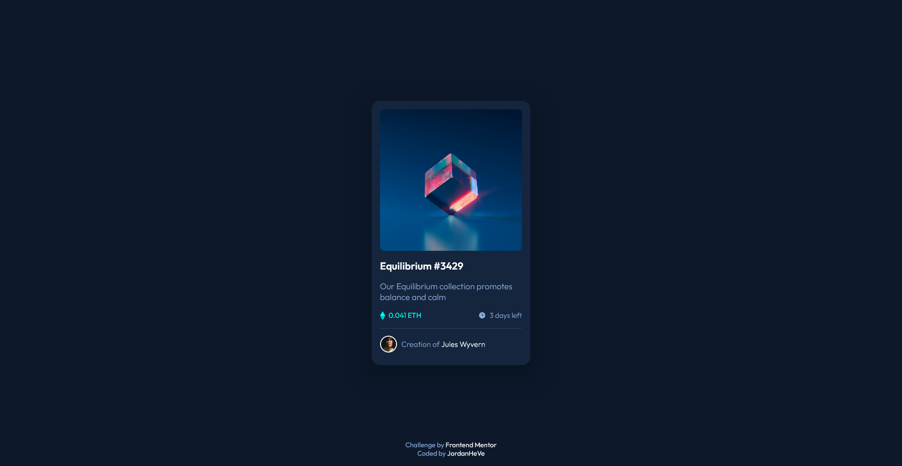

# Frontend Mentor - NFT preview card component solution

This is a solution to the [NFT preview card component challenge on Frontend Mentor](https://www.frontendmentor.io/challenges/nft-preview-card-component-SbdUL_w0U). Frontend Mentor challenges help you improve your coding skills by building realistic projects. 

### Screenshot

### Links

- Live Site URL: [QR Code demo](https://jordanheve.github.io/NFT-card-component/)

### Built with

- Semantic HTML5 markup
- CSS custom properties
- Flexbox

## Author

- GitHub - [JordanHeVe](https://github.com/jordanheve)
- Frontend Mentor - [@jordanheve](https://www.frontendmentor.io/profile/jordanheve)

